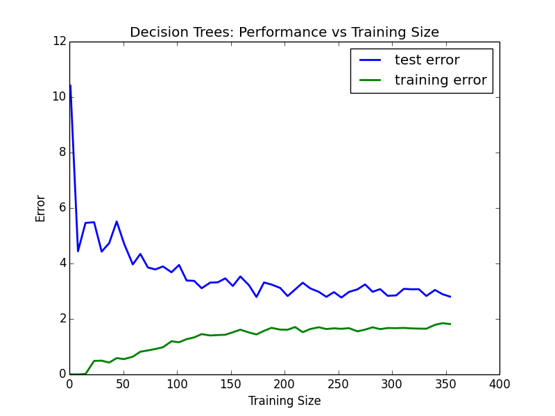
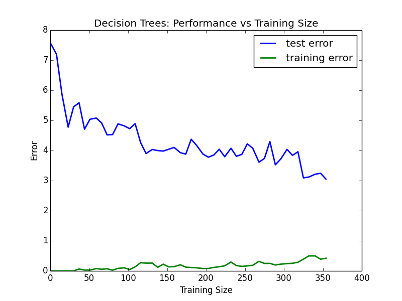
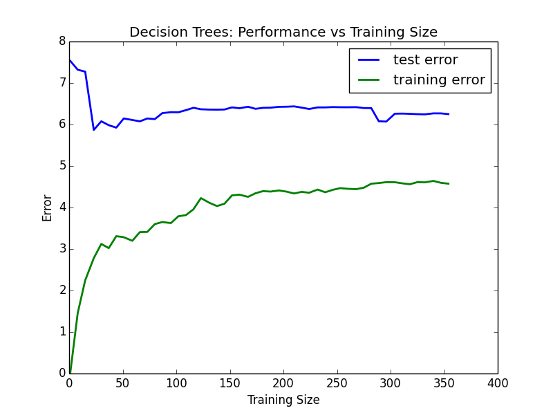
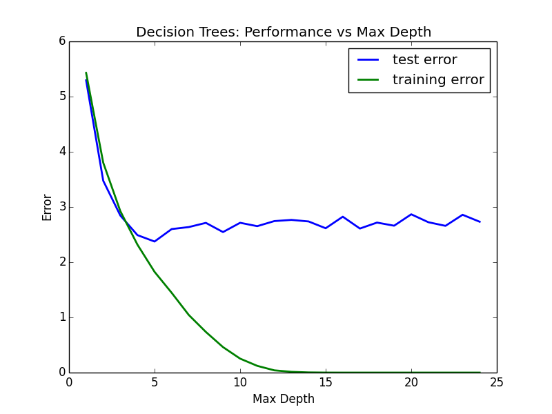

# Predicting Boston Housing Prices

## 1) Statistical Analysis and Data Exploration

* Number of data points (houses)?
    - 506
* Number of features?
    - 13
* Minimum and maximum housing prices?
    - Minimum price: 5.0
    - Maximum price: 50.0
* Mean and median Boston housing prices?
    - Mean price: 22.5
    - Median price: 21.2
* Standard deviation?
    - Standard deviation: 9.2

## 2) Evaluating Model Performance

* Which measure of model performance is best to use for predicting Boston housing data and analyzing the errors? Why do you think this measurement most appropriate? Why might the other measurements not be appropriate here?
    - I ended up using `mean_absolute_error` to measure my model performance.  I'm not certain that it is the absolute best measure I could use, but I believe it works well.  I needed to use a regression metric, since the housing prices are continuous.  I could not have used, for example, a classification metric.  The `mean_squared_error` regression metric would have worked just as well.  If there were outliers, perhaps `median_absolute_error` would have worked best.
* Why is it important to split the Boston housing data into training and testing data? What happens if you do not do this?
    - You cannot evaluate performance by how the model does on training data.  If you did so, the model could just 'hard-code' the expected value for a given data point.  This would amount to overfitting.
* What does grid search do and why might you want to use it?
    - Grid search automatically fine-tunes parameters with cross-validation.  Thus you can improve your model greatly with only a few extra lines of code.
* Why is cross validation useful and why might we use it with grid search?
    - Cross validation is useful because it lets you use all of your data for both testing and training.  Grid search will include cross validation.

## 3) Analyzing Model Performance

* Look at all learning curve graphs provided. What is the general trend of training and testing error as training size increases?
    - In general, as training size increases, training error increases and testing error decreases.  They both approach the same horizontal asymptote with training error approaching the asymptote from below and testing error approaching it from above.  
* Look at the learning curves for the decision tree regressor with max depth 1 and 10 (first and last learning curve graphs). When the model is fully trained does it suffer from either high bias/underfitting or high variance/overfitting?
    - For the decision tree with max depth of 10, there is clear high variance/overfitting.  You can see this because the training error is quite low (close to 0 for a training size of 350), while the testing error is relatively high (about 3.5 for a training size of 350).    
    It is less clear what is happening with the decision tree with max depth of 1.  With a training size of 350, both the testing error and the training error are approaching about 5.5.  Comparing this to a testing error of 3.5 with the decision tree with max depth of 10, this is *perhaps* indicative of high bias/underfitting, but it's not conclusive.  
* Look at the model complexity graph. How do the training and test error relate to increasing model complexity? Based on this relationship, which model (max depth) best generalizes the dataset and why?
    - As the model complexity increases, the training and test error both decrease.  The training error decreases to about 0, while the test error decreases to about 2.6.  The test error first reaches its minimum with about 5 and does not decrease significantly (if at all) after that.  Hence, the model with max depth of 5 best generalizes the data set.  

## 4) Model Prediction

* Model makes predicted housing price with detailed model parameters (max depth) reported using grid search. Note due to the small randomization of the code it is recommended to run the program several times to identify the most common/reasonable price/model complexity.
* Compare prediction to earlier statistics and make a case if you think it is a valid model.
